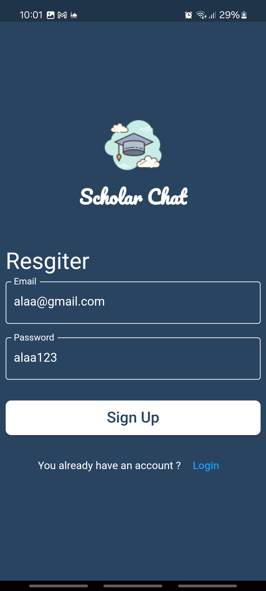
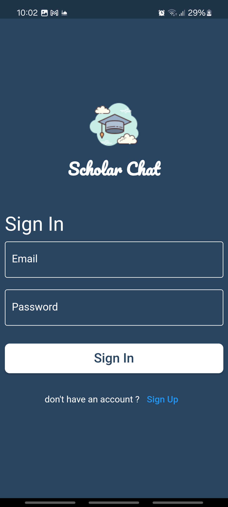
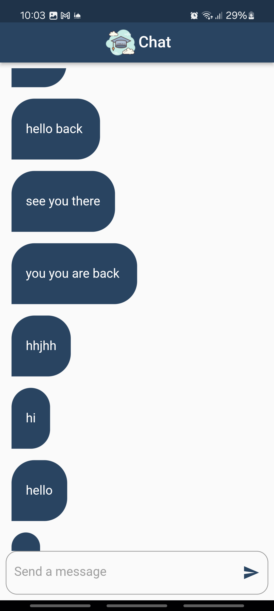

# Chat App 💬

A real-time chat application built with Flutter that leverages Firebase for backend support. This app allows users to send messages, receive updates instantly, and keep their chat history securely stored.

## Features
- **User Authentication:** Firebase Authentication for secure login and registration.
- **Real-Time Messaging:** Messages are sent and received instantly with Firebase Firestore.
  
## Screenshots
Here's a preview of the app screens:
| sign up | login | chat room  |
|---------------|--------------|--------------|
|  |  |  |

## Getting Started

1. Clone the repository:
 
2. Install dependencies:
    ```bash
    flutter pub get
    ```
3. Set up Firebase:
   - Create a Firebase project and add your app.
   - Enable Firebase Authentication and Firestore.
   - Download and add the `google-services.json` file to your Flutter project (for Android).
4. Run the app:
    ```bash
    flutter run
    ```

## Dependencies
- `firebase_core` for Firebase initialization
- `firebase_auth` for user authentication

